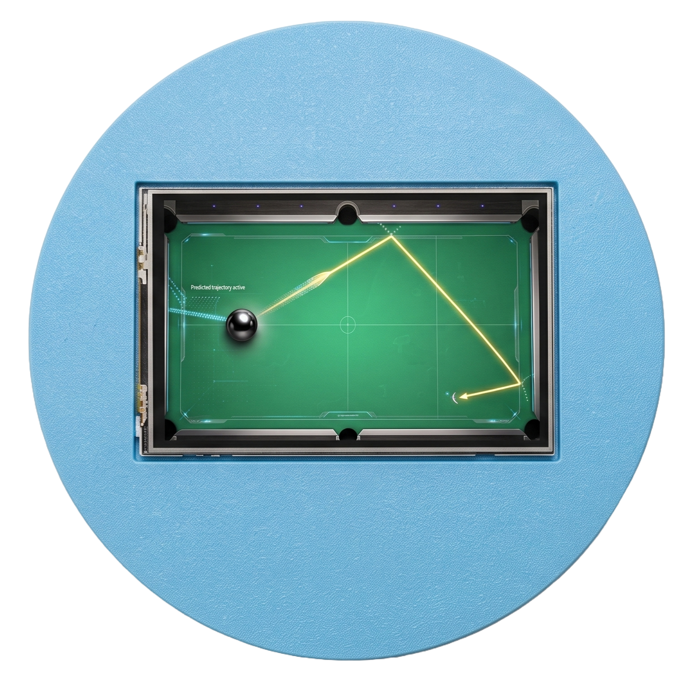
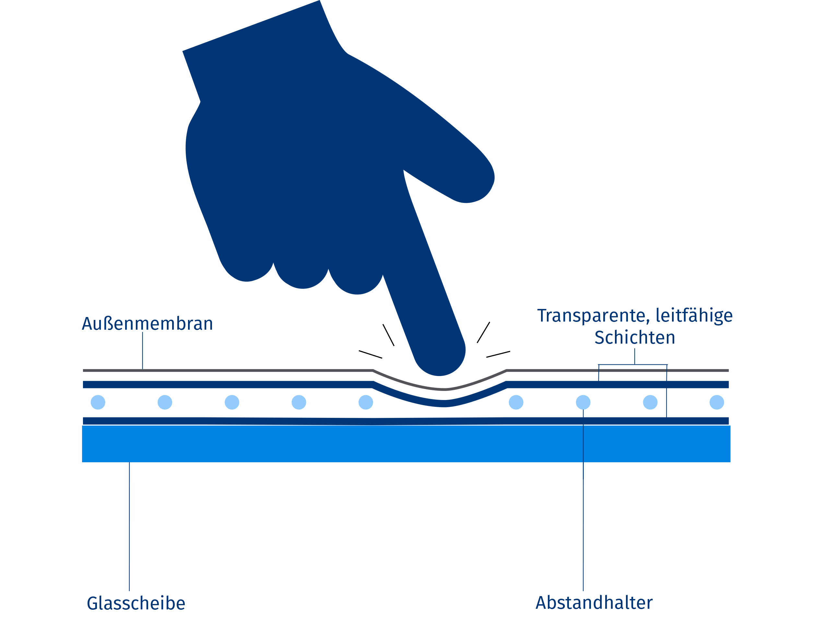

<!--
author:   Nikolas Laaser und Hans Grundig

email:    Hans-Jakob.Grundig@student.tu-freiberg.de

version:  0.0.1

language: de

narrator: Deutsch Female

comment:  Aufgabenblatt für das RemotLab Wabball

repository:     https://github.com/HansGrundig/RemoteLab_Wabball

import: https://raw.githubusercontent.com/liaTemplates/AVR8js/main/README.md

-->

# RemoteLab Wobball
> Herzlich Willkommen zu dem RemoteLab Wabball! 

Stell dir einen smarten Billardtisch vor, der die Bewegung der Kugel präzise verfolgt und sogar die zukünftige Position vorhersagt.  
Genau das bildet dieses RemoteLab nach: Schritt für Schritt lernst du, wie ein solches System Punkte visualisiert, die Kugelposition ausliest, die Spur aufzeichnet, Geschwindigkeit und Richtung bestimmt und schließlich eine Vorhersage trifft.

In diesem Versuch steuerst du eine Kugel auf einer Arduino-gesteuerten beweglichen Plattform. Die Kugel liegt auf einem Display und ihre Position können über die bereitgestellte API ausgelesen werden.

 

## Aufgabenüberblick
1. Punkte auf dem Display plotten ([Direktlink](#Aufgabe-1:-Punkte-auf-dem-Displays-plotten))
2. Auslesen der Position der Kugel ([Direktlink](#Aufgabe-2:-Kugelkoordinaten-ausgeben))
3. Bewegungspfad der Kugel darstellen ([Direktlink](#Aufgabe-3:-Bewegung-der-Kugel-visualisieren))
4. Geschwindigkeit und Bewegungsrichtung der Kugel bestimmen ([Direktlink](#Aufgabe-4:-Geschwindigkeit-und-Richtung-berechnen))
5. Die Bewegungstrajektorie der Kugel vorhersagen ([Direktlink](#Bonusaufgabe-5:-Position-vorhersagen))

> [!Note] 💡 Hinweis:
> Die einzelnen Aufgaben sind mit steigender Schwierigkeit aufgebaut und bauen aufeinander auf. Daher ist es sinnvoll, die Aufgaben in der vorgegebenen Reihenfolge zu bearbeiten
>oder die vorherige Musterlösungen zu übernehmen.

<lia-keep>
    <div class="sketchfab-embed-wrapper"> <iframe title="Assembly 2" frameborder="0" allowfullscreen mozallowfullscreen="true" webkitallowfullscreen="true" allow="autoplay; fullscreen; xr-spatial-tracking" xr-spatial-tracking execution-while-out-of-viewport execution-while-not-rendered web-share src="https://sketchfab.com/models/eefa3e5be18f49cb83b119f35c004882/embed?autospin=1"> </iframe> <p style="font-size: 13px; font-weight: normal; margin: 5px; color: #4A4A4A;"> <a href="https://sketchfab.com/3d-models/assembly-2-eefa3e5be18f49cb83b119f35c004882?utm_medium=embed&utm_campaign=share-popup&utm_content=eefa3e5be18f49cb83b119f35c004882" target="_blank" rel="nofollow" style="font-weight: bold; color: #1CAAD9;"> Assembly 2 </a> by <a href="https://sketchfab.com/HansGru?utm_medium=embed&utm_campaign=share-popup&utm_content=eefa3e5be18f49cb83b119f35c004882" target="_blank" rel="nofollow" style="font-weight: bold; color: #1CAAD9;"> HansGru </a> on <a href="https://sketchfab.com?utm_medium=embed&utm_campaign=share-popup&utm_content=eefa3e5be18f49cb83b119f35c004882" target="_blank" rel="nofollow" style="font-weight: bold; color: #1CAAD9;">Sketchfab</a></p></div>
</lia-keep>


## Technische Umsetzung
- Display: Nextion 5.0" TFT Touch Display:
  - Auflösung: 800x480 Pixel
  - Schnittstelle: UART (Serial)
  - weitere Informationen: [Nextion Display Datasheet](https://nextion.tech/datasheets/NX8048P050-011R/)

- Arduino Uno Wifi:
  - Microcontroller: ATmega328P
  - weitere Informationen: [Arduino Uno Wifi Rev2](https://store.arduino.cc/products/arduino-uno-wifi-rev2)

Verbunden sind Display und Arduino über die Pins **RX1** und **TX1**.

<iframe src="./src/Schema.html" width="100%" height="650px" style="border:none; overflow:hidden;"></iframe>

<lia-keep>
    <style>
  .circuit-svg {
    width: 100%;
    max-width: 800px;
    background-color: #fcfcfc;
    border: 1px solid #e0e0e0;
    border-radius: 8px;
    font-family: monospace, sans-serif;
  }
  
  /* Bauteil-Styling */
  .component { fill: #ecf0f1; stroke: #95a5a6; stroke-width: 2; rx: 6; }
  .arduino { fill: #00979C; stroke: #006b6e; stroke-width: 2; rx: 8; }
  .display { fill: #7f8c8d; stroke: #34495e; stroke-width: 2; rx: 4; }
  .screen { fill: #2c3e50; }
  .servo { fill: #34495e; stroke: #2c3e50; stroke-width: 2; rx: 4; }
  .breadboard { fill: #ffffff; stroke: #bdc3c7; stroke-width: 2; rx: 8; }
  .power-supply { fill: #2c3e50; stroke: #1a252f; stroke-width: 2; rx: 6; }
  .pin { fill: #7f8c8d; stroke: #2c3e50; stroke-width: 1; }
  .usb-port { fill: #bdc3c7; stroke: #7f8c8d; stroke-width: 2; transition: fill 0.2s; }

  /* Text-Styling */
  .text-white { fill: #ffffff; font-size: 14px; font-weight: bold; text-anchor: middle; alignment-baseline: middle; }
  .text-dark { fill: #2c3e50; font-size: 14px; font-weight: bold; text-anchor: middle; }
  .text-pin { fill: #ffffff; font-size: 10px; text-anchor: middle; }
  .text-pin-dark { fill: #2c3e50; font-size: 10px; text-anchor: middle; font-weight: bold; }

  /* Basis-Kabel */
  .wire { fill: none; stroke-width: 3px; transition: all 0.2s ease; cursor: pointer; }
  .wire-5v { stroke: #e74c3c; }
  .wire-gnd { stroke: #222222; }
  .wire-pwm { stroke: #f1c40f; }
  .wire-tx { stroke: #2ecc71; } /* Grün */
  .wire-rx { stroke: #3498db; } /* Blau */

  /* Interaktive Hover-Logik (Gruppe) */
  .wire-group { cursor: pointer; }
  .wire-group .tooltip { opacity: 0; pointer-events: none; transition: opacity 0.2s; }
  
  /* Hover-Effekte auf Elemente innerhalb der Gruppe */
  .wire-group:hover .tooltip { opacity: 1; }
  .wire-group:hover .wire { 
    stroke-width: 6px; 
    filter: drop-shadow(0px 2px 4px rgba(0,0,0,0.3)); 
  }
  .wire-group:hover .usb-port {
    fill: #3498db;
  }

  /* Tooltip-Design */
  .tooltip-bg { fill: #2c3e50; rx: 4; }
  .tooltip-text { fill: #ffffff; font-size: 12px; font-weight: bold; text-anchor: middle; alignment-baseline: middle; }
</style>

<svg class="circuit-svg" viewBox="0 0 800 600" xmlns="http://www.w3.org/2000/svg">

  <defs>
    <marker id="arrow" viewBox="0 0 10 10" refX="9" refY="5" markerWidth="6" markerHeight="6" orient="auto-start-reverse">
      <path d="M 0 1 L 10 5 L 0 9 z" fill="#bdc3c7" />
    </marker>
  </defs>

  <circle cx="180" cy="150" r="140" fill="#f4f6f7" stroke="#d5dbdb" stroke-width="2" stroke-dasharray="8,8" />
  
  <text class="text-dark" x="360" y="55" font-size="12" fill="#bdc3c7" text-anchor="start">Wobball Plattform</text>
  <line x1="330" y1="60" x2="295" y2="80" stroke="#bdc3c7" stroke-width="2" marker-end="url(#arrow)" />

  <rect class="breadboard" x="40" y="310" width="720" height="60" />
  <line x1="50" y1="325" x2="750" y2="325" stroke="#e74c3c" stroke-width="3" />
  <text class="text-dark" x="720" y="320" font-size="12">5V +</text>
  <line x1="50" y1="355" x2="750" y2="355" stroke="#222222" stroke-width="3" />
  <text class="text-dark" x="720" y="365" font-size="12">GND -</text>

  <rect class="power-supply" x="50" y="480" width="100" height="70" />
  <text class="text-white" x="100" y="520">Netzteil</text>
  <rect class="pin" x="70" y="470" width="10" height="10" fill="#222"/>
  <rect class="pin" x="120" y="470" width="10" height="10" fill="#e74c3c"/>

  <rect class="arduino" x="300" y="480" width="200" height="100" />
  <text class="text-white" x="400" y="540" font-size="18">Arduino Uno</text>
  
  <rect class="pin" x="325" y="470" width="10" height="10"/><text class="text-pin" x="330" y="495">TX</text>
  <rect class="pin" x="345" y="470" width="10" height="10"/><text class="text-pin" x="350" y="495">RX</text>
  <rect class="pin" x="405" y="470" width="10" height="10"/><text class="text-pin" x="410" y="495">~8</text>
  <rect class="pin" x="425" y="470" width="10" height="10"/><text class="text-pin" x="430" y="495">~9</text>
  <rect class="pin" x="445" y="470" width="10" height="10"/><text class="text-pin" x="450" y="495">~10</text>

  <rect class="display" x="500" y="50" width="220" height="150" />
  <rect class="screen" x="520" y="70" width="180" height="100" />
  <text class="text-white" x="610" y="125">Nextion TFT</text>
  <rect class="pin" x="535" y="200" width="10" height="10"/><text class="text-pin" x="540" y="195">5V</text>
  <rect class="pin" x="575" y="200" width="10" height="10"/><text class="text-pin" x="580" y="195">GND</text>
  <rect class="pin" x="615" y="200" width="10" height="10"/><text class="text-pin" x="620" y="195">TX</text>
  <rect class="pin" x="655" y="200" width="10" height="10"/><text class="text-pin" x="660" y="195">RX</text>


  <rect class="servo" x="140" y="20" width="80" height="100" />
  <circle cx="180" cy="45" r="20" fill="#95a5a6" stroke="#2c3e50" stroke-width="2"/>
  <text class="text-white" x="180" y="100" font-size="12">Servo 1</text>
  <rect class="pin" x="151" y="120" width="8" height="10"/><text class="text-pin" x="155" y="115">G</text>
  <rect class="pin" x="176" y="120" width="8" height="10"/><text class="text-pin" x="180" y="115">V</text>
  <rect class="pin" x="201" y="120" width="8" height="10"/><text class="text-pin" x="205" y="115">S</text>

  <rect class="servo" x="240" y="160" width="80" height="100" />
  <circle cx="280" cy="185" r="20" fill="#95a5a6" stroke="#2c3e50" stroke-width="2"/>
  <text class="text-white" x="280" y="240" font-size="12">Servo 2</text>
  <rect class="pin" x="251" y="260" width="8" height="10"/><text class="text-pin" x="255" y="255">G</text>
  <rect class="pin" x="276" y="260" width="8" height="10"/><text class="text-pin" x="280" y="255">V</text>
  <rect class="pin" x="301" y="260" width="8" height="10"/><text class="text-pin" x="305" y="255">S</text>

  <rect class="servo" x="40" y="160" width="80" height="100" />
  <circle cx="80" cy="185" r="20" fill="#95a5a6" stroke="#2c3e50" stroke-width="2"/>
  <text class="text-white" x="80" y="240" font-size="12">Servo 3</text>
  <rect class="pin" x="51" y="260" width="8" height="10"/><text class="text-pin" x="55" y="255">G</text>
  <rect class="pin" x="76" y="260" width="8" height="10"/><text class="text-pin" x="80" y="255">V</text>
  <rect class="pin" x="101" y="260" width="8" height="10"/><text class="text-pin" x="105" y="255">S</text>


  <g class="wire-group">
    <rect class="usb-port" x="280" y="510" width="20" height="30" />
    <g class="tooltip" transform="translate(140, 510)">
      <rect class="tooltip-bg" x="0" y="-15" width="130" height="30" />
      <text class="tooltip-text" x="65" y="0">USB Anschluss</text>
    </g>
  </g>

  <g class="wire-group">
    <path class="wire wire-gnd" d="M 75 470 L 75 355" />
    <g class="tooltip" transform="translate(85, 410)">
      <rect class="tooltip-bg" x="0" y="-15" width="130" height="30" />
      <text class="tooltip-text" x="65" y="0">Netzteil Masse (-)</text>
    </g>
  </g>

  <g class="wire-group">
    <path class="wire wire-5v" d="M 125 470 L 125 325" />
    <g class="tooltip" transform="translate(135, 390)">
      <rect class="tooltip-bg" x="0" y="-15" width="130" height="30" />
      <text class="tooltip-text" x="65" y="0">Netzteil 5V (+)</text>
    </g>
  </g>

  <g class="wire-group">
    <path class="wire wire-gnd" d="M 580 210 L 580 355" />
    <g class="tooltip" transform="translate(590, 280)">
      <rect class="tooltip-bg" x="0" y="-15" width="130" height="30" />
      <text class="tooltip-text" x="65" y="0">Display Masse (-)</text>
    </g>
  </g>

  <g class="wire-group">
    <path class="wire wire-5v" d="M 540 210 L 540 325" />
    <g class="tooltip" transform="translate(400, 280)">
      <rect class="tooltip-bg" x="0" y="-15" width="130" height="30" />
      <text class="tooltip-text" x="65" y="0">Display 5V (+)</text>
    </g>
  </g>

  <g class="wire-group">
    <path class="wire wire-pwm" d="M 205 130 C 205 180, 230 180, 230 240 C 230 350, 410 380, 410 470" />
    <g class="tooltip" transform="translate(240, 210)">
      <rect class="tooltip-bg" x="-90" y="-15" width="180" height="30" />
      <text class="tooltip-text" x="0" y="0">Pin 8 (PWM) -> Servo 1</text>
    </g>
  </g>

  <g class="wire-group">
    <path class="wire wire-pwm" d="M 305 270 C 305 340, 430 380, 430 470" />
    <g class="tooltip" transform="translate(360, 310)">
      <rect class="tooltip-bg" x="-90" y="-15" width="180" height="30" />
      <text class="tooltip-text" x="0" y="0">Pin 9 (PWM) -> Servo 2</text>
    </g>
  </g>

  <g class="wire-group">
    <path class="wire wire-pwm" d="M 105 270 C 105 360, 450 380, 450 470" />
    <g class="tooltip" transform="translate(210, 310)">
      <rect class="tooltip-bg" x="-90" y="-15" width="180" height="30" />
      <text class="tooltip-text" x="0" y="0">Pin 10 (PWM) -> Servo 3</text>
    </g>
  </g>

  <g class="wire-group">
    <path class="wire wire-tx" d="M 330 470 C 330 390, 660 390, 660 210" />
    <g class="tooltip" transform="translate(480, 375)">
      <rect class="tooltip-bg" x="-100" y="-15" width="200" height="30" />
      <text class="tooltip-text" x="0" y="0">Arduino TX -> Display RX</text>
    </g>
  </g>

  <g class="wire-group">
    <path class="wire wire-rx" d="M 350 470 C 350 420, 620 420, 620 210" />
    <g class="tooltip" transform="translate(500, 425)">
      <rect class="tooltip-bg" x="-100" y="-15" width="200" height="30" />
      <text class="tooltip-text" x="0" y="0">Arduino RX <- Display TX</text>
    </g>
  </g>


  <g class="wire-group">
    <path class="wire wire-gnd" d="M 155 130 L 155 355" />
    <g class="tooltip" transform="translate(165, 240)">
      <rect class="tooltip-bg" x="0" y="-15" width="130" height="30" />
      <text class="tooltip-text" x="65" y="0">Servo 1 Masse (-)</text>
    </g>
  </g>
  <g class="wire-group">
    <path class="wire wire-5v" d="M 180 130 L 180 325" />
    <g class="tooltip" transform="translate(190, 200)">
      <rect class="tooltip-bg" x="0" y="-15" width="120" height="30" />
      <text class="tooltip-text" x="60" y="0">Servo 1 5V (+)</text>
    </g>
  </g>
  
  <g class="wire-group">
    <path class="wire wire-gnd" d="M 255 270 L 255 355" />
    <g class="tooltip" transform="translate(265, 310)">
      <rect class="tooltip-bg" x="0" y="-15" width="130" height="30" />
      <text class="tooltip-text" x="65" y="0">Servo 2 Masse (-)</text>
    </g>
  </g>
  <g class="wire-group">
    <path class="wire wire-5v" d="M 280 270 L 280 325" />
    <g class="tooltip" transform="translate(290, 285)">
      <rect class="tooltip-bg" x="0" y="-15" width="120" height="30" />
      <text class="tooltip-text" x="60" y="0">Servo 2 5V (+)</text>
    </g>
  </g>
  
  <g class="wire-group">
    <path class="wire wire-gnd" d="M 55 270 L 55 355" />
    <g class="tooltip" transform="translate(45, 310)">
      <rect class="tooltip-bg" x="-130" y="-15" width="130" height="30" />
      <text class="tooltip-text" x="-65" y="0">Servo 3 Masse (-)</text>
    </g>
  </g>
  <g class="wire-group">
    <path class="wire wire-5v" d="M 80 270 L 80 325" />
    <g class="tooltip" transform="translate(90, 285)">
      <rect class="tooltip-bg" x="0" y="-15" width="120" height="30" />
      <text class="tooltip-text" x="60" y="0">Servo 3 5V (+)</text>
    </g>
  </g>

</svg>
</lia-keep>


## Aufgabe 1: Punkte auf dem Displays plotten
--{{0}}--
In unserem smarten Billardtisch möchten wir zunächst die Funktionaliät des Displays überprüfen.
Daher ist deine Aufgabe einen blauen Punkt in  die Mitte des Displays zu plotten.
Nutze dafür die Nextionbefehle.

**Ziel:** Verstehen, wie Punkte auf dem Display dargestellt werden.

{{1}}

> [!Note] 💡 Hinweis:
> Über die Funktion `sendNextionCommand()` kannst du Nextion-Befehle an das Display senden.
>
>```cpp
>void sendNextionCommand(const char *command) {
>    Serial1.print(command);
>    Serial1.write(0xFF);
>    Serial1.write(0xFF);
>    Serial1.write(0xFF);
>}
>```
>(*siehe [Nextion-Instruction-Set](https://nextion.tech/instruction-set/) )


### **Musterlösung**

```cpp 

char cmd[64];
sprintf(cmd, "cirs %d,%d,2,31", 400 , 240);     // 400,240 = Mitte des Displays
sendNextionCommand(cmd);

```
--------------------
--{{3}}--
**Quizfrage:**

Wie groß ist der gesendete Nachricht in der Musterlösung (inkl. Terminations bytes)?

    [[20]]
    [[?]] sprintf wandelt den Befehl in einen String um
    [[?]] Jedes Zeichen in einem String ist 1 byte
    [[?]] Beachte Leerzeichen und Kommas
**************

Die Lösung ist 20, weil:

| Textteil      | Zeichen | Anzahl der Bytes |
|:------------- | -------:| ----------------:|
| Der Befehl    |  cirs_  |                5 |
| X-Koordinate  |   400   |                3 |
| Y-Koordinate  |   240   |                3 |
| Punktgröße    |    2    |                1 |
| 3x Komma      |   ,     |                1 |
| Farbwert      |   31    |                2 |
| 3x Stopp Bytes|  0xFF   |                1 |

Der string `cmd` endet mit 1 byte großem \n, welcher aber nicht mit geschickt wird

**************

## Aufgabe 2: Kugelkoordinaten ausgeben
--{{0}}--
Da wir nun Punkte auf dem Display plotten können, wollen wir nun die Position der Kugel auslesen.  
Lass dir dafür aktuellen Koordinaten der Kugel auf dem Serial Monitorausgeben.

**Ausgabe-Beispiel:**

```text
x = 123
y = 87
x = ...
y = ...
```

**Ziel:** Die Positionsdaten der Kugel auslesen und anzeigen.


> [!Note] 💡 Hinweis:
> Mit der Methode `jiggle()` kannst du die Kugel leicht anstoßen, damit sich ihre Position verändert.

### Exkurs: Nextion Resistiver Touchscreen
Der Nextion NX8048P050-011R Touchscreen ist ein resistiver Touchscreen, der auf Druck reagiert.
Dabei wird durch Druck auf die Oberfläche ein elektrischer Kontakt von zwei Elektroden hergestellt, der die Position des Drucks ermittelt.



weitere Informationen: [Resistiver Touchscreen](https://www.leifiphysik.de/elektrizitaetslehre/komplexere-schaltkreise/ausblick/resistiver-touchscreen)


### **Musterlösung**

```cpp 

while (Serial1.available()) {
    // Nächstes Byte aus dem Nextion-Stream lesen.
    uint8_t b = static_cast<uint8_t>(Serial1.read());

    // Auf das Startbyte der Positionsnachricht warten.
    if (state == 0) {
        if (b == 0x68) { 
            // Neue Nachricht beginnt: Buffer zurücksetzen.
            index = 0;
            state = 1;
        }
        continue;
    }

    // Weitere Bytes der Nachricht im Puffer sammeln.
    data[index++] = b;
    if (index < 7) continue; 

    // Eine vollständige Nachricht endet mit drei 0xFF-Bytes.
    if (data[4] == 0xFF && data[5] == 0xFF && data[6] == 0xFF) {
        // Zwei 8-Bit-Werte zu einem 16-Bit-X- und Y-Wert zusammensetzen.
        int16_t x = (static_cast<int16_t>(data[1]) << 8) | data[0];
        int16_t y = (static_cast<int16_t>(data[3]) << 8) | data[2];

        Serial.print("x = ");
        Serial.println(x);
        Serial.print("y = ");
        Serial.println(y);
    }
}

```

## Aufgabe 3: Bewegung der Kugel visualisieren

Damit zeichnet der smarte Billardtisch die Trajektorie der Kugel wie eine digitale Stoßspur nach.
Plotte kontinuierlich den zurückgelegten Pfad der Kugel.

>[!IMPORTANT] ❗ Anforderungorderungen:
>* Immer dort einen Punkt zeichnen, wo die Kugel das Display berührt.
>* Es dürfen maximal **10 Punkte gleichzeitig** sichtbar sein.
>* Sobald ein elfter Punkt hinzugefügt wird, soll der **älteste Punkt gelöscht** werden.

**Ziel:** Die Bewegung der Kugel als Spur darstellen.


### Musterlösung

```cpp
```

## Aufgabe 4: Geschwindigkeit und Richtung berechnen

Gib über die serielle Schnittstelle (`Serial`) kontinuierlich aus:

* Geschwindigkeit in **Pixel pro Sekunde (px/s)**
* Bewegungsrichtung in **Grad (°)**


**Ausgabe-Beispiel**

```text
Geschwindigkeit: 54.2 px/s
Richtung: 137.5°
```

> [!Note] 💡 Hinweis:   
>* Berechne die Geschwindigkeit aus zwei aufeinanderfolgenden Positionsmessungen.
>* Die Richtung kann über den Winkel zwischen den beiden Positionen bestimmt werden.

**Ziel:** Bewegungsdaten der Kugel auswerten.

An dieser Stelle lernt der smarte Billardtisch, wie schnell und in welche Richtung sich die Kugel über das Spielfeld bewegt. Gib die Ergebnisse dazu über die serielle Schnittstelle (`Serial`) kontinuierlich aus:

* Geschwindigkeit in **Pixel pro Sekunde (px/s)**
* Bewegungsrichtung in **Grad (°)**

### Musterlösung
```cpp

```

---

## Bonusaufgabe 5: Position vorhersagen

Schreibe eine Funktion

```cpp
predict(x, y, vel, dir)
```

welche aus

* aktueller X-Koordinate
* aktueller Y-Koordinate
* Geschwindigkeit (`vel`)
* Richtung (`dir`)

die erwartete Position der Kugel **eine Sekunde später** berechnet.

>[!IMPORTANT] ❗ Anforderungorderungen:
>1. Berechne die vorhergesagte Position.
>2. Gib die vorhergesagten Koordinaten aus.
>3. Zeichne zur Visualisierung einen Punkt an der vorhergesagten Position.

### Beispiel

```text
Aktuelle Position: (100, 50)
Geschwindigkeit: 20 px/s
Richtung: 0°

Vorhersage nach 1 s:
(120, 50)
```

**Ziel:** Einführung in Bewegungsmodelle und Vorhersage von Positionen.

Zum Schluss wird der smarte Billardtisch vorausschauend und berechnet, wo die Kugel in einem Moment später auf dem Tisch liegen wird.

## Fazit

Am Ende hast du aus einem einfachen Display- und Sensorkonstrukt einen kleinen smarten Billardtisch gemacht, der Punkte setzt, Positionen liest, Bewegungen sichtbar macht und sogar die nächste Kugelposition abschätzt. Die Aufgaben führen damit von der reinen Ausgabe bis zur einfachen Bewegungsprognose in einer zusammenhängenden, praxisnahen Kette.

---

## Feedback

Wie hat dir unsere RemoteLab gefallen?

    [(1)] ⭐
    [(2)] ⭐⭐
    [(3)] ⭐⭐⭐
    [(4)] ⭐⭐⭐⭐
    [(5)] ⭐⭐⭐⭐⭐

Was können wir deiner Meinung nach Verbessern?

    [[___]]

Vielen Danke für deine Teilnahme 💟


